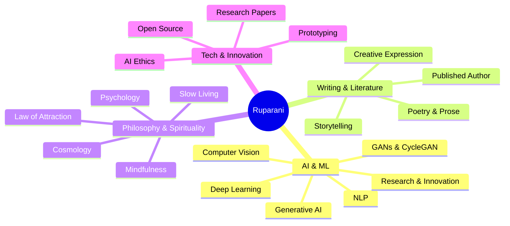
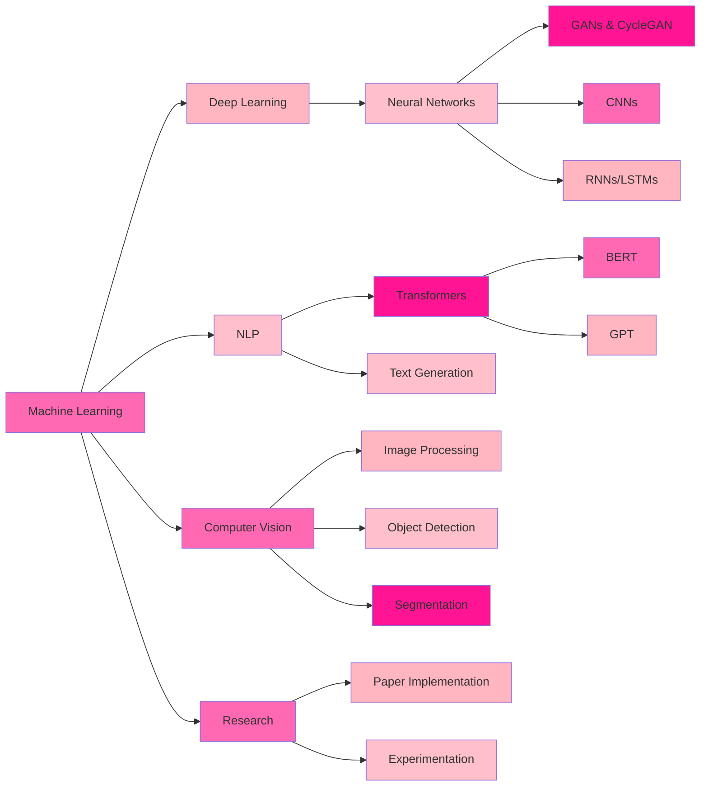

# ✨ Ruparani Thupakula

<div align="center">

<!-- Animated Typing Header -->


<br/>

<!-- Animated GIF Banner -->


<br/>

<!-- Profile Views & Social Badges -->


[](https://linkedin.com/in/yourprofile)
[](https://amazon.com/author/ruparani)
[](mailto:your.email@example.com)
[](https://yourportfolio.com)

</div>

---

## 🌸 About Me — Where Code Meets Consciousness

```python
class CosmicEngineer:
    def __init__(self):
        self.name = "Ruparani Thupakula"
        self.role = "AI/ML Engineer 🤖"
        self.location = "🌏 Building from India"
        self.passions = ["Machine Learning", "Generative AI", "Writing", "Philosophy"]
        self.philosophy = "Building intelligence with intention 🌺"
        self.fuel = "☕ Coffee + 📚 Books + 🎨 Creativity"
        self.current_focus = ["GANs", "CycleGAN", "NLP", "Deep Learning"]
        
    def daily_ritual(self):
        while self.coffee.isHot():
            self.read_research_papers()
            self.train_models()
            self.write_code()
            self.contemplate_universe()
            self.write_stories()
        
    def life_motto(self):
        return """
        Like the cosmic dance — 
        Creating, transforming, evolving.
        Each line of code, a verse.
        Each model, a universe.
        """

me = CosmicEngineer()
me.daily_ritual()
```

<div align="center">

</div>

I'm **Ruparani** — an **AI/ML Engineer** who believes technology should be as thoughtful as it is powerful. I build intelligent systems at the intersection of **machine learning**, **deep learning**, and **generative AI**, while drawing inspiration from cosmology, psychology, and literature.

### 🌟 Beyond the Code

- 📖 **Published Author** of 2 books on Amazon KDP
  - *"The Epitome of Slow Living"* — A journey of mindfulness and authenticity
  - *"Echoes of Her Intact Heart"* — A tribute to love and resilience
- 🧘‍♀️ Exploring consciousness through **psychology**, **law of attraction**, and ancient wisdom
- 🌌 Fascinated by **cosmology** and the universe's mysteries
- 📚 Forever a student of literature and human nature
- 🎨 Believer in creating technology that serves humanity

---

## 🎨 My Universe of Interests

<div align="center">



</div>

---

## 💻 Tech Stack — My Tools of Creation

<div align="center">

### 🔤 Languages & Core Technologies


### 🧠 AI/ML Frameworks & Libraries


### 🛠️ Tools & Platforms


</div>

---

## 🔬 Research & Innovation Focus

<div align="center">

| 🧠 Domain | 🎯 Focus Area | ✨ Current Exploration |
|-----------|---------------|------------------------|
| **Generative AI** | GANs, CycleGAN, Diffusion Models, Variational Autoencoders | Creating new realities & synthetic data |
| **Natural Language Processing** | Transformers, LLMs, Text Generation, Sentiment Analysis | Teaching machines to understand language |
| **Deep Learning** | Neural Architecture, CNNs, RNNs, Optimization Techniques | Building adaptive digital brains |
| **Computer Vision** | Image Processing, Object Detection, Segmentation | Giving sight to algorithms |
| **Machine Learning** | Supervised/Unsupervised Learning, Reinforcement Learning | Pattern recognition & prediction |
| **Research & Innovation** | Experimental Architectures, Novel Approaches | Pushing boundaries of AI |

</div>

<div align="center">

</div>

---

## 📚 Published Works — When Code Becomes Poetry

<div align="center">

### ✍️ Amazon KDP Author

<table>
<tr>
<td width="50%" align="center">

<h3>📖 The Epitome of Slow Living</h3>
<p><i>"Finding peace in life's simplest moments"</i></p>
<p>A story of mindfulness, authenticity, and choosing to live—not just exist. An exploration of what it means to slow down in a fast-paced world and find beauty in the ordinary.</p>
<br>
<a href="https://amazon.com/author/ruparani">

</a>
</td>
<td width="50%" align="center">

<h3>💝 Echoes of Her Intact Heart</h3>
<p><i>"A daughter's tribute to her mother"</i></p>
<p>Celebrating unconditional love, strength, and the bonds that transcend time. A heartfelt journey through the relationship between mother and daughter.</p>
<br>
<a href="https://amazon.com/author/ruparani">

</a>
</td>
</tr>
</table>

> *"Code teaches machines. Writing teaches humans. Together, they illuminate consciousness."*

</div>

---

## 🌟 Current Brewing Projects

<div align="center">

</div>

- ☕ **Generative AI Experiments** — Exploring creative model architectures and novel GAN implementations
- 🧠 **NLP Research** — Language understanding, generation systems, and transformer fine-tuning
- 🎨 **CycleGAN Projects** — Style transfer and image-to-image translation experiments
- 🔬 **Deep Learning Research** — Investigating neural architecture optimization and novel training techniques
- 🌐 **Open Source Contributions** — Building tools and libraries for the ML community
- 📖 **Third Book** — Weaving AI philosophy with human wisdom (coming soon!)
- 🌌 **AI × Spirituality Blog** — Where technology meets consciousness

---

## 📊 GitHub Analytics — Powered by Coffee & Curiosity

<div align="center">


</div>

---

## 🎯 Skills Constellation

<div align="center">



</div>

---

## 🌸 Philosophy × Technology

<div align="center">

### *"Like the cosmic dance — creating, destroying, transforming"*


</div>

I believe the best technology is built at the intersection of:

- 🧠 **Deep Understanding** — Psychology & human consciousness
- 🌌 **Cosmic Perspective** — Seeing the bigger picture beyond immediate problems
- 📚 **Literary Wisdom** — Stories and narratives that illuminate truth
- 🎨 **Creative Expression** — Finding beauty in logic and code
- 💫 **Mindful Innovation** — Technology built with intention and purpose
- 🌸 **Slow Living Principles** — Quality over speed, depth over breadth
- ✨ **Ethical AI** — Building systems that serve humanity

### 💭 My Approach to AI

> Technology is not just about solving problems—it's about understanding humans. Every model I train, every line of code I write, is infused with the question: "How does this serve consciousness?"

---

## 🎓 Learning Journey & Growth

<div align="center">

### 📖 Currently Exploring


### 🎯 2024 Goals

- [ ] Publish research paper on novel GAN architectures
- [ ] Contribute to 5+ major open source ML projects
- [ ] Complete advanced NLP specialization
- [ ] Launch AI × Philosophy blog series
- [ ] Release third book combining tech and consciousness
- [ ] Build 3 production-ready AI applications
- [ ] Mentor aspiring AI engineers

</div>

---

## 🤝 Let's Create Together

<div align="center">

### I'm always interested in:

🔬 **Research Collaborations** — Pushing AI boundaries together, exploring novel architectures  
🤖 **Generative AI Projects** — Creating intelligent, creative systems that surprise and delight  
📖 **Writing & Tech** — Bridging literature and technology, making AI accessible  
🌟 **Open Source** — Building tools that matter, contributing to the community  
☕ **Coffee Chats** — Deep conversations about AI, philosophy, consciousness, and life  
🎨 **Creative AI Applications** — Using ML for art, music, and creative expression  
🧠 **AI Ethics Discussions** — Building responsible and human-centered AI

<br/>

### 📬 Reach Out


**Let's build something beautiful — where intelligence meets intention** ✨

[](https://linkedin.com/in/yourprofile)
[](mailto:your.email@example.com)
[](https://twitter.com/yourhandle)
[](https://yourportfolio.com)

</div>

---

## 💝 Support My Work

<div align="center">

If you find my work valuable or my projects helpful:

[](https://buymeacoffee.com/ruparani)
[](https://ko-fi.com/ruparani)

<sub>Your support helps fuel more coffee, more code, and more cosmic explorations! ☕✨</sub>

</div>

---

## 📈 Contribution Graph

<div align="center">


</div>

---

## 🏆 Achievements & Highlights

<div align="center">


</div>

---

## 📝 Latest Blog Posts

<!-- BLOG-POST-LIST:START -->
- 🧠 [Understanding GANs: From Theory to Implementation](#)
- 🎨 [CycleGAN: The Art of Unpaired Image Translation](#)
- 📚 [The Philosophy of AI: Where Technology Meets Consciousness](#)
- ☕ [Coffee-Driven Development: My Workflow](#)
- 🌸 [Slow Living in Tech: Finding Balance as an Engineer](#)
<!-- BLOG-POST-LIST:END -->

---

## 🎵 Coding Playlist Vibe

<div align="center">

*Currently coding to:* 🎧


</div>

---

## 💬 Random Dev Quote

<div align="center">


</div>

---

<div align="center">


### 🌸 *Crafted with coffee, consciousness, and code* 🌸

**"In the garden of intelligence, every model is a flower, every line of code is a seed, and every bug is a lesson in impermanence."**

<sub>⭐ Star this repo if you resonate with the cosmic engineering vibe! ⭐</sub>


</div>

---

<div align="center">


**Last Updated:** December 2024 | **Built with** 💖 **and** ☕

</div>
